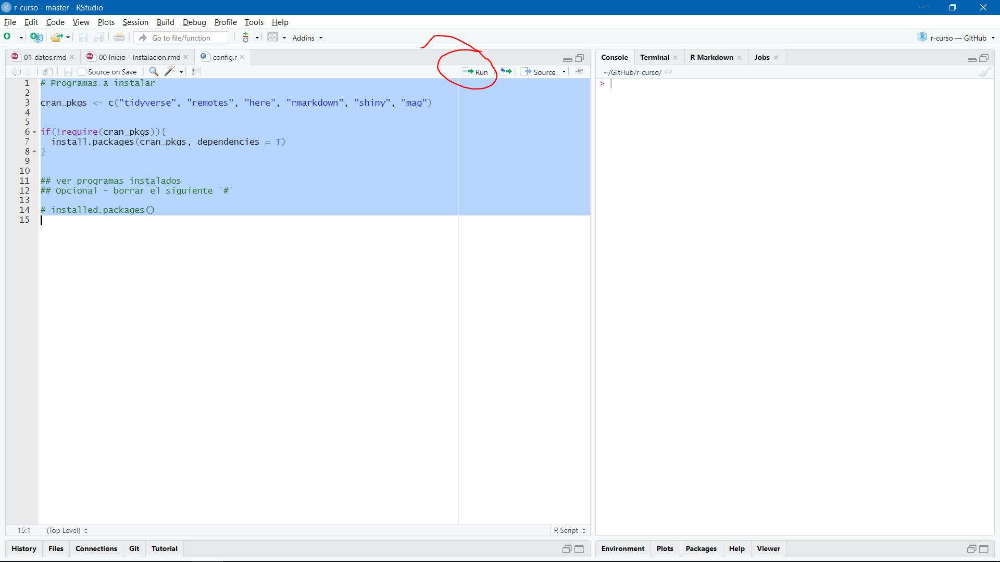

---
output:
  xaringan::moon_reader:
    lib_dir: libs
    seal: false
    css: ["moi1.css"]
    nature:
      highlightStyle: github
      highlightLines: true
      countIncrementalSlides: false
      ratio: "16:9"
---
```{r child = "complementarios/set.Rmd"}
```

.pull-left[
.center-left[
# Instalaciones

Jhon

Fecha: `r Sys.Date()`
]
]
.pull-right[

]

---
class: middle

# Chocolatey - Windows 10

--

Abrir powershell como administrador

--

Correr el siguiente codigo 

--

```{r eval = F}
Set-ExecutionPolicy Bypass -Scope Process -Force; \[System.Net.ServicePointManager\]::SecurityProtocol = \[System.Net.ServicePointManager\]::SecurityProtocol -bor 3072; iex((New-Object System.Net.WebClient).DownloadString(‘<https://chocolatey.org/install.ps1>’))
```
--

## Listo

--

Mas informacion en chocolatey.org 

O solo seguir mis instrucciones en https://github.com/TJhon/R-curso/README.md

---
class: middle
# Instalacion de R, Rstudio, pandoc y Rtools
--

Abrir poweshell como administrador 

`choco install r r.studio rtools pandoc rtools -y`


--

Si tambien se quiere instalar miktex para el entorno de \LaTeX

`choco install miktex -y`

---
class: inverse
# Antes de empezar 

Abrir `config.r` con Rstudio, seleccionar todo y dar click en `run`

.middle-column[

]

---
```{r, child="complementarios/gracias.rmd", eval = T}

```

