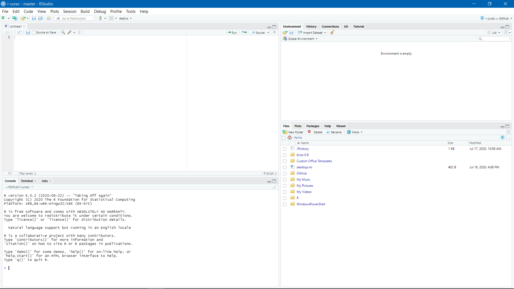
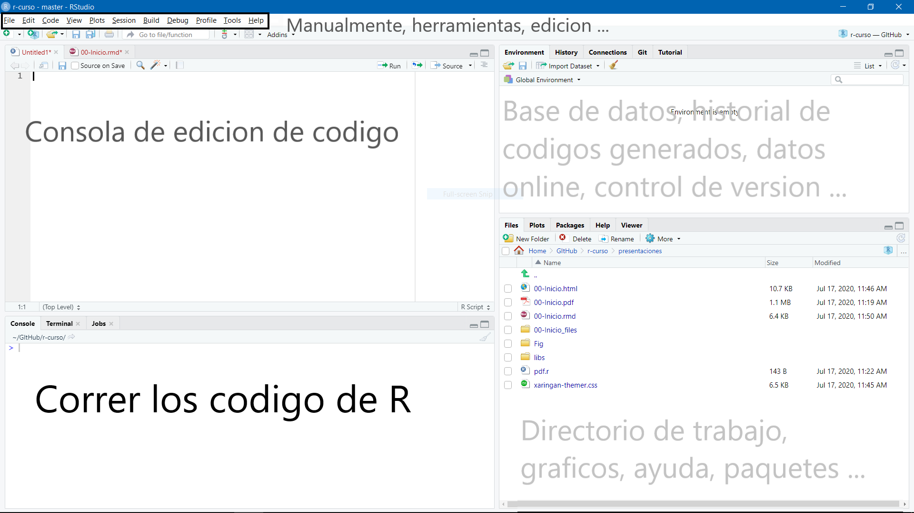
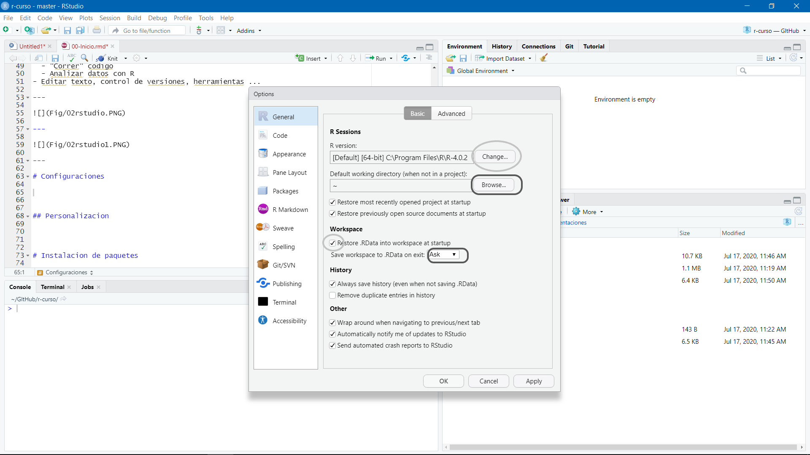
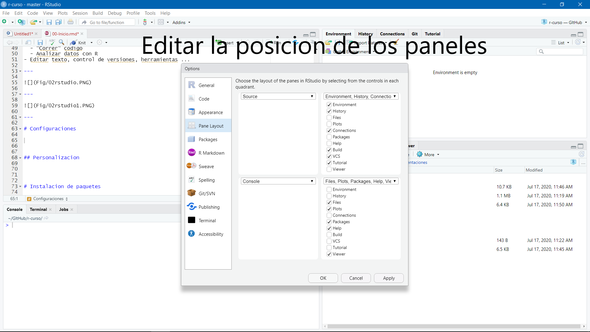
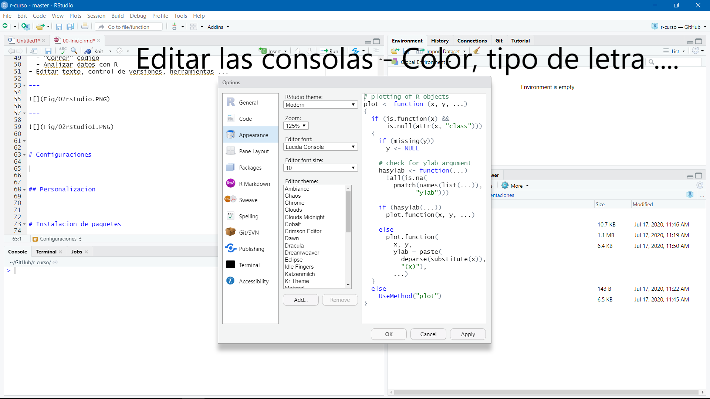

---
output:
  xaringan::moon_reader:
    lib_dir: libs
    seal: false
    css: ["moi1.css"]
    nature:
      highlightStyle: github
      highlightLines: true
      countIncrementalSlides: false
      ratio: "16:9"
---
```{r child = "complementarios/set.Rmd"}
```

```{r, include = F}
knitr::opts_chunk$set(
  eval = F
)
```

.pull-left[
.center-left[
# R Studio
# Primeros pasos

Jhon

Fecha: `r Sys.Date()`
]
]
.pull-right[

]

---


class: middle
## Rstudio que es? 

--

### Integrated Development Environment
--

Ques significa?

--

Un entorno de desarrollo integrado (IDE) es un sistema de software para el diseño de aplicaciones que combina herramientas del desarrollador comunes en una sola interfaz gráfica de usuario (GUI).
---
class: middle
# Rstudio

- IDE preferido para R
  - Escribir codigo 
  - "Correr" codigo
  - Analizar datos con R
- Editar texto, control de versiones, herramientas ...  

---

## Paneles 

.middle-column[

]


---

## Paneles 

.middle-column[


]


---
class:   center, middle
# Configuraciones 
## (Tools -> Global Options)

---

## Guardar lo que uno necesita

.middle-column[


]


---

## Personalizacion paneles

.middle-column[


]


---

## Personalizacion colores

.middle-column[


]

---
```{r, child="complementarios/gracias.rmd", eval=T}

```
