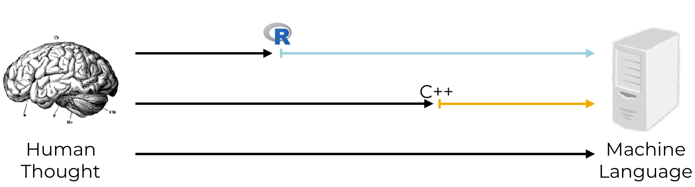

---
output:
  xaringan::moon_reader:
    lib_dir: libs
    seal: false
    css: ["moi1.css"]
    nature:
      highlightStyle: github
      highlightLines: true
      countIncrementalSlides: false
      ratio: "16:9"
---
```{r child = "complementarios/set.Rmd"}
```

```{r, include = F}
knitr::opts_chunk$set(
  eval = F
)
```

.pull-left[
.center-left[
# R
# Cuestiones generales

Jhon

Fecha: `r Sys.Date()`
]
]
.pull-right[

]

---

# R 

Esto es lo que se hace en un lenguaje informatico.
.middle-column[

]

---

# Funciones 


Cada paquete(package), incorpora funciones para poder ser usadas en el entorno de R. 
.middle-column[

]
---

## Instalacion (1 por computadora)

### Mediante el repostitorio general de CRAN

install.packages("libreria-de-cran-comillas")

```{r}
install.packages("remotes")
install.packages("devtools")
```

### Mediante Github

Los 2 metodos equivalen a lo mismo la diferencia recae en que `devtools` puede llamar de otros repositorios en linea.

```{r}
remotes::install_github("r-lib/here")
devtools::install_github("r-lib/here")
```

---

## Usando paquetes


### Una por R sesion

Cargar la libreria mediante la funcion `library(paquete)`

```{r}
library(here)
```


### Para un solo uso 

En lo siguiente se resume para un solo uso `paquete::funcion_del_paquete`, los `::` solo llama a las funciones inmediatas.

```{r}
here::here()
```
---
# Tidyverse 

En resumen ver la figura 
.middle-column[

]

---
class: inverse
# `Tidyverse`

Su entorno es muy amigable con los principiantes en el lenguaje de R.

### Instalacion

```{r}
install.packages("tidyverse")
```

### Equivale a instalar todos los siguientes paquetes.

```{r, eval=TRUE, results='asis'}
tidyverse::tidyverse_packages()
```

---
# Ayuda

Buscar ayuda en la documentacion con `help(funcion)` = `?funcion`


```{r}
help(lm)
?lm
```

Otra manera de buscar ayuda es mediante `??funcion` el cual buscara en internet documentacion relacionada.

```{r}
??lm
```
---
class: inverse
# Practicar 

Usar el archivo `config.r` e instalar los programas necesarios.
Si no lo encuentras prueba con `ctrl + .` y busca el archivo.

```{r, eval = T, results='asis'}
dir(here::here())
```


<!-- Despues de esto abstenerse de editar-->

---

```{r, child="complementarios/gracias.rmd", eval=T}

```


