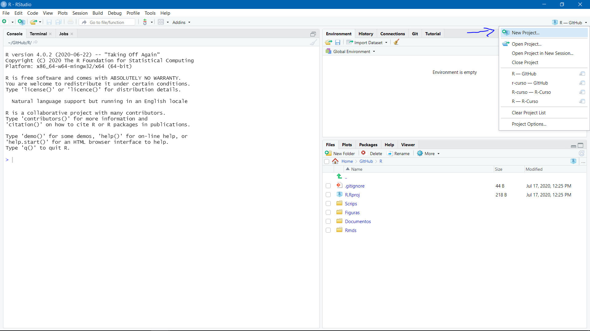
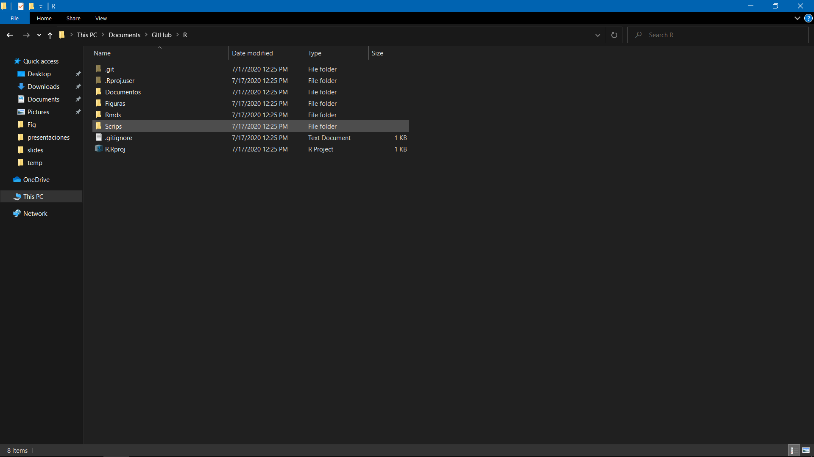
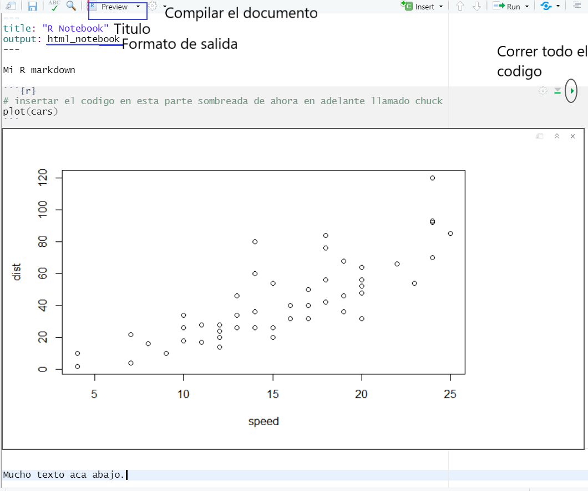

---
output:
  xaringan::moon_reader:
    lib_dir: libs
    seal: false
    css: ["moi1.css"]
    nature:
      highlightStyle: github
      highlightLines: true
      countIncrementalSlides: false
      ratio: "16:9"
---
```{r child = "complementarios/set.Rmd"}
```

```{r, include = F}
knitr::opts_chunk$set(
  eval = F
)
```

.pull-left[
.center-left[
# R
# Recomendaciones

Jhon

Fecha: `r Sys.Date()`
]
]
.pull-right[

]

---

## El problema

.middle.column[

]

## Reproducir y automatizar del documento

[ver video](https://www.youtube.com/watch?v=s3JldKoA0zw)

Dejar de usar Office!

---

## La solucion 1

.middle-column[

]

```{r}
choco install git
```

---

## Git

1. Controlador de versiones del entorno de trabajo. 
1. Enteder los nombres de un word como multiples versiones de un trabajo.
1. Asimismo con el trabajo en grupo.
1. Cada edicion de parrafos, graficos, tablas etc. es la modificacion de la version. 
1. Git graba cada edicion del entorno de trabajo para poder tener multiples versiones de este, asimismo permite la combinacion de documentos que tienen el mismo entorno sin crear mas archivos que el que uno lo permita, lo que hace mas eficiente la edicion de codigo. 

---

class: middle
## La solucion II

--

### Proyectos 
--


En RStudio uno debe acostumbrarse a trabajar con proyectos y el uso de `git` para evitar en lo posible cometer errores que pueden afectar toda la estructura del trabajo. 

---

### Creacion de proyectos 

- New directory -> New Proyect 
- Nombre de la carpeta y la ubicacion del proyecto
- Si se tiene instalado `Git` - activar la opcion
- Create Project

.middle-column[

]
---

## Entorno de trabajo 

- Carpetas con exteniones de archivos, o caracteristicas generales

.middle-column[

]

---

## La solucion II 
### Rmarkdown

Usar un `RMarkdown` facilita mucho el trabajo de la edicion y compilacion de resultados en el mismo documento, por lo que se sugiere siempre trabajar con este tipo de documento si ya va a presentar su informe. 

Las ventajas de este tipo de documentos es que se actualiza constantemente con los resultado que uno quiere o no mostrar en su documento.

Este es un R Notebook

.middle-column[

]
---

### R notebook partes

.middle-column[

]

<!-- Despues de esto abstenerse de editar-->
---
```{r, child="complementarios/gracias.rmd", eval=T}

```

