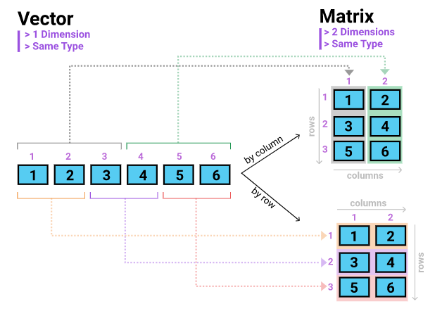
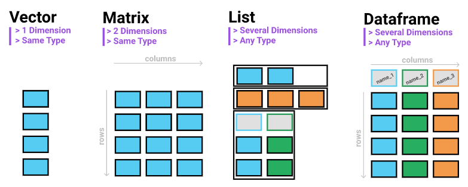

---
output:
  xaringan::moon_reader:
    lib_dir: libs
    seal: false
    css: ["moi1.css"]
    nature:
      highlightStyle: github
      highlightLines: true
      countIncrementalSlides: false
      ratio: "16:9"
---
```{r child = "complementarios/set.Rmd"}
```

```{r , include=FALSE}
knitr::opts_chunk$set(eval = T)
```

.pull-left[
.center-left[
# R
# Breve introduccion al lenguaje

Jhon

Fecha: `r Sys.Date()`
]
]
.pull-right[

]

---
## Funciones basicas 

```{r}
# + - / * 
# suma, resta, division, multiplicacion 

1 + 2

# exp(2), 3^2, sqrt(2), log(2), log10(2)
```
Lo anterior se traduce como:

$$e^2, 3^2, \sqrt2, ln(2), log(2)$$

---

## Variables

```{r}
# Anteriormente se sugirio el uso de `%>%` 
# crear x con el valor de 12
x <- 12

# crear y con el valor de 8

y <- 8

```
---
## `c()` funcion 

Esta funcion se puede entender como crear

```{r}
# Creacion de un vector con los elementos 1, 2, 3, 4
elementos <- c(1, 2, 3, 4)

# Lo anterior se puede escribir de varias maneras:
elementos <- 1:4
c(1, 2, 3, 4) -> elementos

```

---

## Extraccion de elementos de un vector `[i]` 

[i] indica la posicion del elemento que queremos.

```{r}
# Vector 
celular_precios <- c(120, 130, 400, 500)

# Extraer el primer elemento del vector mediante 
celular_precios[1]

# Extraer todos menos el primer elemento
celular_precios[-1]

# Con `c()` extraer el elemento 1 y 4
celular_precios[c(1,4)]

```

---

## Uniendo todo 

### Operaciones con variables


```{r}
x <- 12
y <- 8
x - y
```


### Operaciones con vectores 

```{r}
vector_1 <- 6:1
2 * vector_1

```

---

### Operaciones con vectores 

```{r, eval = T}
# 6 elementos
vector_1 <- c(1, 2, 3, 4, 5, 6)
vector_2 <- 6:1
# Suma Vectores 

vector_1 + vector_2

# Multiplicacion 
vector_1 * vector_2

```
---
class: center, middle
# Tipo de variables 

**typeof()** funcion

---

### Character, String

```{r}
x <- "Hola mundo, soy Jhon"
typeof(x)
```


### Numeric-Double (Reales o decimales)

```{r}
x <- 12.12
typeof(x)
```

### Integer

```{r}
x <- 1:12
typeof(x)
```
---

### Logical

```{r}
y <- c(TRUE, TRUE, FALSE, FALSE)
typeof(y)

typeof(as.numeric(y))
```

### Mezcla de elementos

```{r}
choco <- c(1, 3, 4 , TRUE, FALSE, "ALGO mas")
#typeof(choco)
```

---
class: center, middle
# Datos 
---

## Matrices 

---

## Creacion de matrices

matrix() Function

```{r}
# Vector
v <- 1:12
# Matrix

matrix(v)

```
---

```{r}
# 2 columnas de arriba abajo
matrix(v, ncol = 2)
```

---

```{r}
# 2 columnas izquierda derecha
matrix(v, ncol = 2, byrow = T)
```


---
class: center, middle

## Data frames


---

```{r}
# Vectores 

a1 <- c(1:12)
a2 <- c(12:1)
a3 <- c(4:15)
a4 <- c(20:9)
# rbind union por filas 
# rbind == t(cbind) 
valores_r <- rbind(a1, a2, a3, a4)
valores_r

```

---

```{r}
# cbind union por columnas
valores_c <- cbind(a1, a2, a3, a4)
valores_c

```
---

## Nombres

```{r}
nombre <- c("Nombre a1", "Otro nombre a2", "Otro mas", "")
colnames(valores_c) <- nombre
valores_c
colnames(valores_c)
```

---

## Extraer elementos `[]`

Recordando: Las coordenadas de una matriz son por fila y columnas en ese orden 

```{r}
valores_c[1, ] # Extraer la primera fila
```

```{r}
valores_c[, -1] # Extraer todo menos la primera  columna
```
Despues de saber eso, se conoce el fuldamento basico de la selecion y filtrado de datos 

---

```{r}
valores_c[1, 4] #valor individual 
```

Algo mas complejo

```{r}
valores_c[c(9, 3), c(1, 3,4)]
```

Remplazar valores

```{r}
valores_c[c(9, 3), c(1, 3,4)] <- 1
valores_c[c(9, 3), c(1, 3,4)]

```

---
 
## Listas 
 
Para explicar que es una lista se debe conocer todo lo anterior.
Ya que cada uno de los anteriores elemento puede ser parte de una lista, inclusive una lista es puede se parte de una lista


---
## Ejemplo 
### Base de datos
```{r}
knitr::kable(head(iris), format = 'html')
```

---
### La funcion lm() 

```{r}
# Creacion del modelo
modelo <- Sepal.Length ~ Sepal.Width + Petal.Length
# Minimos cuadrados ordinarios
resultado <- lm(modelo, data = iris)
typeof(resultado)
```

---
```{r}
summary(resultado)
```

---

Vector 

```{r}
resultado$call
```
Matrices

```{r}
resultado$coefficients
```
Data frames
```{r}
head(resultado$model)
```

---

Listas dentro de listas

```{r}
summary(resultado$xlevels)
```

---

## Creacion de listas list()

```{r}
lista <- list("UNCP", "economia", c(1, 1, 23, 4, 5), TRUE, valores_c)
lista
```
---

Desordenado! muchos `[[]]`

```{r}
lista [[1]]
```


---

```{r}
mi_lista <- list(universidad  = "UNCP", facultad = "economia", vector = c(1, 1, 23, 4, 5), logical = TRUE, matrix = valores_c, lista = lista[[4]])
mi_lista
```
---
Ahora se puede extraer con `$`

```{r}
mi_lista$universidad
```

---
class: center, middle
# Funciones en R 

---

## Creacion de funciones 

```
nombre_funcion <- function(variable1, variable2){
    # lo que se quiere hacer con las variables
}
```
```{r}
mi_suma <- function(x, y, z){
  x + y + z
}
mi_suma(1, 3, 4)
```
---

## Usando funciones dentro de las funciones

```{r}
# mean() calcula el promedio de los elementos 
x <- 1:12

mean(x)

mi_promedio <- function(a) {
  a1 <- sum(a)
  a2 <- length(a)
  promedio <- a1/a2
  paste0("El promedio de los datos es: ", promedio)
}

mi_promedio(x)

```


---

## If, else 

Verdadero o falso?

```{r}
x <- 12
x < 3 
x > 5
x == 12 # en R se usa `==` para preguntar si es igual
```
---
```{r}
x != 12 # Desigual 
x <= 13 # menor o igual
x >= 1 # mayour o igual
```

La funcion  `If` evalua si el enunciado o la proposicion solo si es verdadera y hace lo que especificas dentro del `{}`, por otro lado `else` evalua en algun otro caso.  

---

```{r}
Individuo <- "yo"
if(Individuo == "yo"){
  print("Aquel individuo era yo")
} else {
  print("No recuerdo")
}

```

```{r}
Individuo <- "yo"
if(Individuo != "yo"){
  print("Aquel individuo era yo")
} else {
  print("Ese individuo no era yo")
}

```

---

## For loops 

Evitar hacer codigos reiterativos

Se quiere este resultado final:

$$Demanda = 60 P - P^2$$ 

Con precios = [10, 20, 30, 40, 50]

## Manera manual o metodo excel 

```{r}
demanda <- c(
  -1 * 10^2 + 60 * 10,
  -1 * 20^2 + 60 * 20,
  -1 * 30^2 + 60 * 30,
  -1 * 40^2 + 60 * 40,
  -1 * 50^2 + 60 * 50)
demanda
```
---
## For - loops

```{r}
precio <- c(10, 20, 30, 40, 50)
demanda <- c()

for (price in precio) {
  calc <- -1 * price^2 + 60 * price
  demanda <- c(demanda, calc)
}
demanda
```

---
## Packages

Para explorar la estructura de las funciones de los paquetes instalados, solo se necesita cargar el paquete y escribir la funcion sin `()`.

Explorar la funcion de minimos cuadrados ordinarios

```{r}
stats::lm
```

---
```{r gracias, child = 'complementarios/gracias.rmd'}
```
