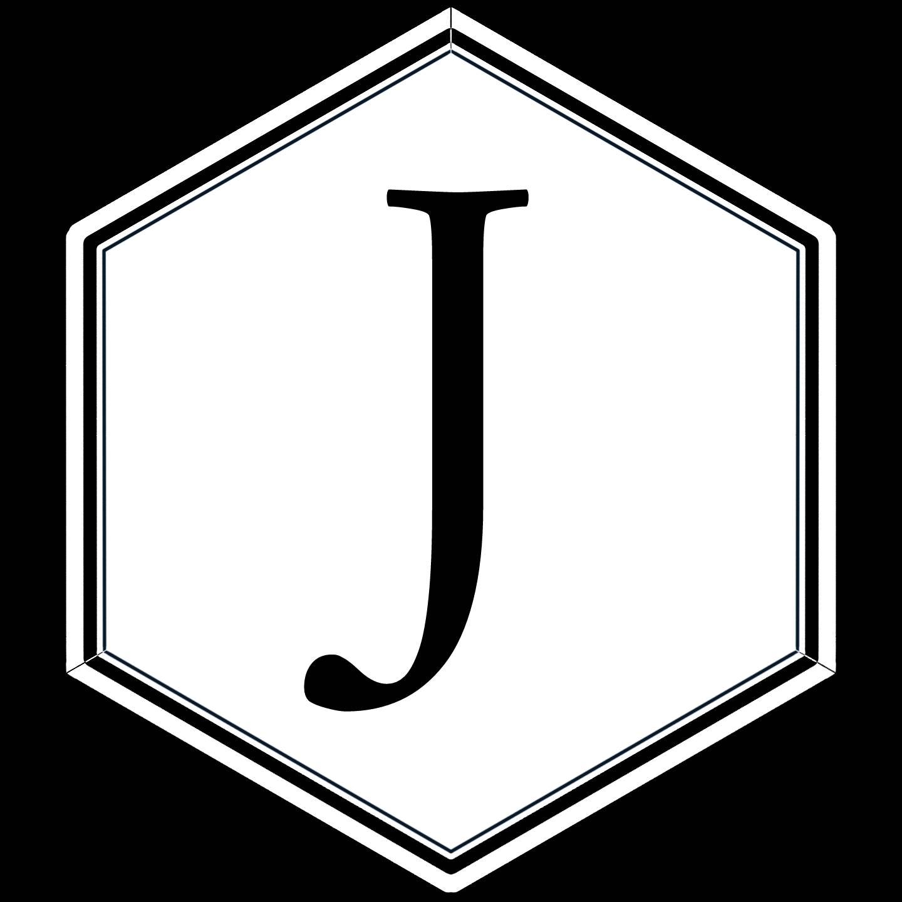

---
output:
  xaringan::moon_reader:
    lib_dir: libs
    seal: false
    css: ["moi1.css"]
    nature:
      highlightStyle: github
      highlightLines: true
      countIncrementalSlides: false
      ratio: "16:9"
---
```{r child = "complementarios/set.Rmd"}
```

```{r , include=FALSE}
knitr::opts_chunk$set(eval = T)
```

.pull-left[
.center-left[
# R
# Un poco de tidyverse

Jhon

Fecha: `r Sys.Date()`
]
]
.pull-right[

]
---

# Verdadero o Falso (valores logicos)

---

```{r}
typeof(FALSE)
typeof(TRUE)
logi <- c(T, F, T, F)
typeof(logi)
sum(logi)
as.numeric(logi) # funcion para convertir a numeros
```
En conclusion en `R`, `TRUE` == T = 1 y `FALSE` == F = 0
---
### Utilidad

Muestras coincidencia en las observaciones dada ciertas caracteristicas

```{r}
alfa <- c(12, 12, 13, 15, 20)
alfa < 14
# Esos elementos que son verdaderos pueden ser 
# separados de los falsos y crear una nueva base de datos
```


---
class: center, middle
# Caracteres - String 

Texto
---

### `""` o `''`

```{r}
"yo" 
"tu"
'1'
"
Parrafo de un
texto 
con varias linas
"
```
`\n`?
---
### Caracteres especiales 

`\n`: establece una nueva linea

```{r}
cat("Escribir\nnueva linea")
```
`\t`: tabulacion 

```{r}
cat("Este texto \ttabulado")
```
---
class: center

# Datos categoricos - Factor
- Conjunto de valores 
- Un conjunto ordenado de niveles válidos
---
```{r}
condicion <- factor(c("soltero", "casado", "casado", "soltero"))
condicion
condicion <- factor(c("soltero", "casado", "casado", "soltero"), 
            levels = c("soltero", "casado", "divorciado"))
condicion
typeof(condicion)
```
---
class: center, middle
# Datos temporales 
---

```{r}
# Fecha y hora 
hoy <- Sys.Date()
hoy
ahora <- Sys.time()
ahora

as.numeric(hoy) # valor numerico para la fecha de hoy
as.numeric(ahora) # valor numerica para `ahora`
```
---
class: center, middle
# Tidyverse 

---
class: middle
## Librerias 

```{r, message=F, warning=F}
library(forcats) 
library(stringr)
library(lubridate)
```

---

# StringR y stringi

```{r}
x <- c("Aprender", "algo", "de", "tidyverse", "mediante", "R", "-", "Studio") 
str_length(x) #cantidad de letras por elemento
cat(str_c(x, collapse = ",\n ")) # un parrafo extrano

```
---

```{r}
str_subset(x, "[ae]") # extraer elementos que contengan la `a` y `e`

str_count(x, '[aeiou]') # contar cuantas coincidencias hay

str_sub(x, start = 1, end = 2) # util para crear identificadores

str_to_upper(x, "es") #si no se especifica la region por default es ingles

x <- c("soñar", "camión", "égoïsta")

stringi::stri_trans_general(x, "Latin-ASCII")
```
---

## Forcats


```{r, echo = F}
dato <- gss_cat %>%
  tidyr::drop_na() %>% 
  dplyr::count(age, marital) %>%
  dplyr::group_by(age) %>%
  dplyr::mutate(prop = n / sum(n))
```

Desordenado 
.pull-left[
```{r g1, fig.show='hide'}
library(ggplot2)
ggplot(dato, aes(age, prop, color = marital)) +
  geom_line()
```
]
.pull-right[
```{r ref.label="g1", echo=F}
```
]

---

## Forcats

Ordenado
.pull-left[
```{r eval=F}
ggplot(dato, aes(age, prop, 
                 colour = fct_reorder2(marital, age, prop))) + #<<
  geom_line() +
  labs(colour = "marital")
```
]
.pull-right[
```{r, echo = F}
ggplot(dato, aes(age, prop, colour = fct_reorder2(marital, age, prop))) +
  geom_line() +
  labs(colour = "marital")
```
]
---
## Lubridate 
### ymd(year, month, day)

ymd(), es una funcion para establecer el orden de los datos presentados, para que este pueda entenderlo como si es una fecha, `y`, `m`, y `d` pueden rotar.

```{r}
ymd("2019/01/09") #anio mes dia

ydm("2019/01/12") #anio dia mes

mdy("January 9, 2019") # mes dia anio
```
---
### Extraccion 

```{r}
hoy <- Sys.Date()
year(hoy)
month(hoy)
month(hoy, label = T)
day(hoy)
```
---
```{r}
anio_mes <- paste(year(hoy), month(hoy), sep = "-")

parse_date_time(anio_mes, 'ym')
```

---

```{r gracias, child = 'complementarios/gracias.rmd'}
```


